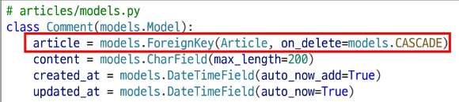

# 관계
- 데이터베이스 내 여러 테이블 간의 논리적인 연결 관계를 나타냄

# 관계 종류
- 1:1 (One to One) 관계
    - 한 테이블의 레코드는 다른 테이블의 한 레코드와 연결됨
    - 예시) 한 사람당 하나의 주민등록번호
- N:1 (Many to One) 관계
    - 여러 개의 레코드가 하나의 레코드와 연결됨
    - 예시) 여러 교육생(N)을 한 강사(1)가 가르침
- N:N (Many to Many) 관계
    - 여러 레코드가 여러 레코드와 상호 연결됨
    - 보통 중간 테이블(예 : 수강신청)을 사용해 구현됨
    - 예시) 여러 학생(N)이 여러 과목(M)을 수강함

# ForeignKey 필드
- ForeignKey(to, on_delete)
    - to 속성
        - 참조하는 모델 class 이름 (N:1에서 N이 아닌 1의 class 정보)
    - on_delete
        - 외래 키가 참조하는 객체(1)가 사라졌을 때, 외래 키를 가진 객체(N)를 어떻게 처리할 지를 정의 하는 설정 (데이터무결성)
    - **데이터 무결성**
        - 데이터가 정확하고 일관되며, 신뢰할 수 있도록 유지되는 상태

# on_delete 속성 종류
- CASCADE
    - 참조 된 객체(부모 객체)가 삭제 될 때 이를 참조하는 모든 객체도 삭제되도록 지정
    - 예) 게시글이 삭제되면 해당 게시글의 모든 댓글을 삭제
- PROTECT
    - 삭제 하려는 부모 객체에 자식 객체가 존재한다면 해당 부모 객체를 삭제하지 못하도록 지정
    - 예) 게시글을 삭제할 때 해당 게시글에 댓글이 존재하면 게시글 삭제 불가
- SET_NULL
    - 부모 객체가 삭제되면, 해당 필드에 값이 NULL이 저장되도록 지정
    - 단, 해당 ForeignKey필드 설정이 null = True가 설정 되어야 함

# 댓글 모델 정의하기
- ForeignKey 클래스의 인스턴스 이름은 참조하는 모델 클래스 이름의 단수형으로 작성하는 것을 권장

# Migration 이후 댓글 테이블 확인
- 만들어 지는 필드 이름 규칙
    - '작성한 외래 키 필드명' + '_' + 'id'
- 댓글 테이블의 article_id 외래 키 필드 확인
    - bigint 자료형 확인
- bigint 자료형
    - 64비트 정수형으로 약 9경까지 저장할 수 있으며, 숫자의 고갈 걱정이 없어 Primary Key(PK)를 선언할 때 해당 자료형을 사용함
    - 외래 키는 이러한 PK 정보를 저장하기 때문에 동일하게 해당 자료형을 사용

