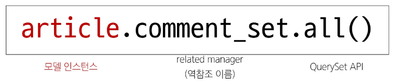
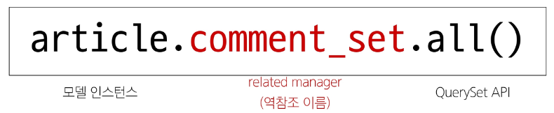
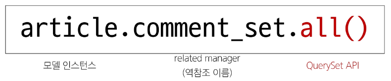

# 참조
- 직접 대상의 정보를 저장하고 필요 할 때 활용하는 것

# 특정 게시글(Article)의 댓글(Comment) 정보 조회
- QuerySet API의 .all() 사용하기 XXXXXXX
    - 특정 게시글(Article)의 댓글(Comment)들이 아닌 모든 댓글 정보를 가져오게 됨
    - comments = Comment.objects.all()
- QuerySet API의 .filter() 사용하기
    - 특정 게시글(Article) 정보를 조회 후 댓글(Comment)에서 filter를 활용해 댓글 조회 가능
    - article = Article.objects.get(pk=1)
    - comments = Comment.objects.filter(article=article)

# 역참조
- 누가 나를 참조하는지 거꾸로 조회 하는 것

# 역참조 기본 구조 (1/3)

1. 모델 인스턴스
    - models.py 에 정의된 모델 클래스로 생성된 실제 데이터를 의미
        - 'article.title'과 같이 속성에 접근 가능하며 속성을 수정할 수 있음
    - 역참조에서는 참조 가능한 필드가 없는 모델 클래스의 인스턴스를 사용하면 됨
        - Article(1) : Comment(N) -> Article 에 참조 필드가 없어서 Article의 인스턴스를 사용

# 역참조 기본 구조 (2/3)

2. related manager (역참조 이름)
    - related manager 라고 부르며 N:1 혹은 N:M 관계에서 역참조 시에 사용하는 매니저를 의미
    - 'objects' 매니저를 통해 QuerySet API를 사용했던 것 처럼 related manager를 통해 QuerySet API를 사용할 수 있게 됨

# 역참조 기본 구조 (3/3)

3. QuerySet API
    - 데이터를 가져오기 위한 쿼리 결과 집합을 만드는 인터페이스
    - SQL 쿼리를 직접 쓰지 않고도 DB를 사용할 수 있음

# related manager (역참조 이름) 이름 규칙
- 모델 클래스명 + _set 이 기본 값이며 Django에서 자동으로 생성해 줌
- 관계를 직접 정의하지 않은 모델에서 연결된 객체들을 조회할 수 있게 함
- 특정 댓글의 게시글 참조(Comment -> Article)
    - comment.article
- 특정 게시글의 댓글 목록 역참조(Article -> Comment)
    - article.comment_set.all()
