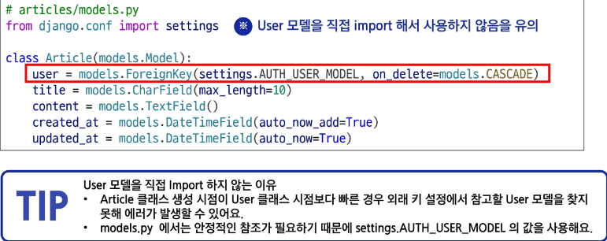

# User 모델 관계 설정
- User 외래 키 정의

# User 모델을 참조하는 2가지 방법
- settings.AUTH_USER_MODEL
    - settings.py 에서 정의된 AUTH_USER_MODEL 설정 값을 가져옴
    - 반환 값 : 'accounts.User' (문자열)
    - models.py에서 User모델을 참조할 때 주로 사용
- get_user_model()
    - 현재 settings.py에 정의되어 활성화된 User 모델을 가져옴
    - 반환 값 : User Object(객체)
    - models.py를 제외한 다른 모든 위치에서 사용

