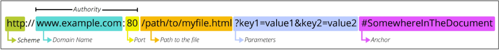

# API
- 두 소프트웨어가 서로 통신 할 수 있게 하는 메커니즘
# API 역할
- 예를 들어 우리 집 냉장고에 전기를 공급해야 한다고 가정해보자
- 우리는 그냥 냉장공의 플러그를 소켓에 꽂으면 제품이 작동한다
- 중요한 것은 우리가 가전 제품에 "전기를 공급하기 위해 직접 배선을 하지 않는다"는 것.
- 이는 매우 위험하면서도 비효율적인 일이기 때문
- 복잡한 코드를 추상화하여 대신 사용할 수 있는 몇 가지 더 쉬운 구문을 제공

# Web API
- 웹 서버 또는 웹 브라우저를 위한 API
- 현대 웹 개발은 하나부터 열까지 직접 개발하기보다 여러 Open API들을 활용
- 대표적인 Third Party Open API 서비스 목록
    - Youtube API
    - Google Map API
    - Naver Papago API
    - Kakao Map API

# REST (Representational State Transfer)
- API Server를 개발하기 위한 일종의 소프트웨어 설계 방법론

# REST에서 자원을 정의하고 주소를 지정하는 방법
- 자원의 '식별'
    - URI
- 자원의 '행위'
    - HTTP Methods
- 자언의 '표현'
    - JSON 데이터(궁극적으로 표현되는 데이터 결과물)

## 자원
- 웹에서 고유한 주소를 통해 접근할 수 있는 데이터나 기능의 대상

# 자원 식별 URI(Uniform Resource Identifier : 통합 자원 식별자)
- 인터넷에서 리소스(자원)를 식별하는 문자열
- 웹에서 주어진 리소스의 주소

- Schema (or Protocol)
    - 브라우저가 리소스를 요청하는 데 사용해야 하는 규약
    - URL의 첫 부분은 브라우저가 어떤 규약을 사용하는지를 나타냄
    - 기본적으로 웹은 http(s)를 요구
        - 메일을 열기위한 mailto: , 파일을 전송하기 위한 ftp: 등 다른 프로토콜도 존재
- Domain Name
    - 요청 중인 웹 서버를 나타냄
    - 어떤 웹 서버가 요구되는 지를 가리키며 직접 IP주소를 사용하는 것도 가능, 사람이 외우기 어렵기 때문에 주로 Domain Name으로 사용

- Port
    - 웹 서버의 리소스에 접근하는데 사용되는 기술적인 문(Gate)
    - HTTP 프로토콜의 표준 포트
        - HTTP - 80
        - HTTPS - 443
    - 표준 포트만 작성 시 생략 가능

- Path
    - 웹 서버의 리소스 경로
    - 초기에는 실제 파일이 위치한 물리적 위치를 나타냈지만, 오늘날은 실제 위치가 아닌 추상화 된 형태의 구조를 표현

- Parameters
    - 웹 서버에 제공하는 추가적인 데이터
    - '&' 기호로 구분되는 key-value 쌍 목록
    - 서버는 리소스를 응답하기 전에 이러한 파라미터를 사용하여 추가 작업을 수행할 수 있음

- Anchor
    - 일종의 '북마크'를 나타내며 브라우저에 해당 지점에 있는 콘텐츠를 표시
    - '#' (fragment identifier, 부분 식별자) 이후 부분은 서버에 전송되지 않음

# HTTP Request Methods
- 리소스에 대한 행위 수행하고자 하는 동작을 정의

# HTTP Request Methods 종류
- GET
    - 서버에 리소스의 표현을 요청
    - GET을 사용하는 요청은 데이터만 검색해야 함
- POST
    - 데이터를 지정된 리소스에 제출
    - 서버의 상태를 변경
- PUT
    - 요청한 주소의 리소스를 수정
- DELETE
    - 지정된 리소스를 삭제

# HTTP response status codes
- 특정 HTTP 요청이 성공적으로 완료 되었는지 여부를 나타냄

# HTTP response status codes 종류
- Informational responses (100-199)
    - 요청을 계속 진행 중이라는 중간 응답
- Successful responses (200-299)
    - 요청이 정상적으로 처리되었음을 의미
- Redirection messages (300-399)
    - 요청한 리소스가 다른 위치로 옮겨졌을 때 사용
- Client error responses (400-499)
    - 클라이언트 요청에 문제가 있을 때 반환
- Server error responses (500-599)
    - 서버 내부의 문제로 요청을 처리하지 못했을 때 사용
